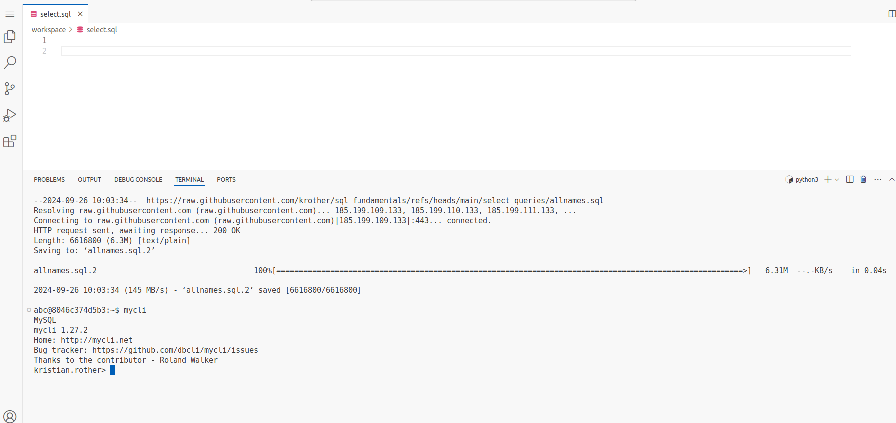

# Read Baby Name Data

## The Dataset

The US authorities have registered the names of all US citizens born
since 1880. The record is `publicly available <http://www.ssa.gov/oact/babynames/limits.html>`__.

In this and the following chapters, you will analyze this data.
If you want to use the ``pandas`` library, you find a list of useful
functions at the bottom.

## Preparations

1. Go to [hackschule.de]( https://workspace.hackschule.de/) 
2. Login with your email address
3. You will receive an email with a confirmation code 
4. Enter the confirmation code and press the green button **Workspace öffnen** to open your workspace.
5. [You should see](../Images/Landing%20screen.png)
6. [Open VSCode](../Images/VScode%20screen.png)
7. [Click on the menu (three bars, top left) select "File -> New Text File" and save the file with "File -> Save" or Ctrl-s. Save the file name as session1.sql](../Images/NewTextFile.png)
8. click on the menu (**"Terminal -> New Terminal"**)
9. in the terminal window at the bottom ,copy-paste the following two commands:

    wget https://github.com/krother/sql_fundamentals/raw/refs/heads/main/select_queries/allnames.sql
    mysql < allnames.sql

Now connect to the SQL database with:

    mycli

You should see the prompt

    mysql>

## Inspect the database

Type the following command into the prompt:

    SHOW TABLES;

Press <Enter>. You should see there is one table `babynames`.

You can display the columns of the table with:

    DESCRIBE babynames;

## SELECT queries

In this section, we will go through basic parts of `SELECT`, the most important SQL command.

### Exercise 1: Select everything

Let's start with the most straightforward SQL query:

    SELECT * FROM babynames;

### Exrcise 2: Limit output

Display the first 5 rows only:

    SELECT * FROM babynames LIMIT 5;

### Exercise 3: Paging

Add the following term to the very end of the previous query:

    LIMIT 5 OFFSET 4

How does the `OFFSET` keyword work?

Inspect the 3rd and 4th "page".

### Exercise 4: Select columns

Limit the output to two columns:

    SELECT name, births FROM babynames;

Also try:

    SELECT name AS baby, births AS count FROM babynames;

### Exercise 5: Select rows

The `WHERE` keyword lets you add a filter:

    SELECT * FROM babynames WHERE name='George';

Edit the query to select only the `births` column.

### Exercise 6: Edit the query

Check if your name occurs in the data.
(Names with fewer than 100 occurences have been removed from the data).

### Exercise 7: Filtering with numbers

Below you find more examples of row selection.
Build them into a query and explain what happens.

* `WHERE births = 100`
* `WHERE births >= 10000`
* `WHERE births BETWEEN 10000 AND 11000`
* `WHERE births = 100 AND gender = 'F'`

Find out how many times the name **Taylor** occured in each year since 2000.

### Exercise 8: Sorting

What is the difference between the two queries:

    SELECT name, births FROM babynames WHERE year=2023 ORDER BY name;

and

    SELECT name, births FROM babynames WHERE year=2023 ORDER BY births DESC;

### Exercise 9: SELECT from scratch

Find out:

- the 10 most popular girls names in 2023
- the 10 most popular boys names in 2023
- the most frequently occuring name in any single year

### Exercise 10: Celebrities

Investigate the popularity of the names of some US celebrities over the last 130 years.
Inspect the following celebrities or choose your own:

======== ==========================================
name     comment
======== ==========================================
Madonna  wrote “Like a Prayer”
Lance    went to the moon
Katrina  hurricane in New Orleans
Luke     Jedi
Leia     princess from Star Wars
Frida    painter, biography went on a Broadway show
Arielle  mermaid
Khaleesi job title in ‘Game of Thrones’
======== ==========================================

### Exercise 11: Arithmetics

SQL has a collection of standard math functions.
Try the following queries and discuss what they do.

    SELECT name, births * 100 FROM babynames LIMIT 5;
    
    SELECT name, round(births / 100, 2) FROM babynames LIMIT 5;
    
    SELECT * FROM babynames WHERE births % 333 = 0 LIMIT 5;
    
    SELECT name, births, pow(births, 2) FROM babynames WHERE name = 'Madonna' LIMIT 5;

    SELECT name, births, log(births) FROM babynames WHERE name = 'Madonna' LIMIT 5;
    
    SELECT name, births, exp(births) FROM babynames WHERE name = 'Madonna' LIMIT 5;

How could you make the header of one of the outputs nicer?
